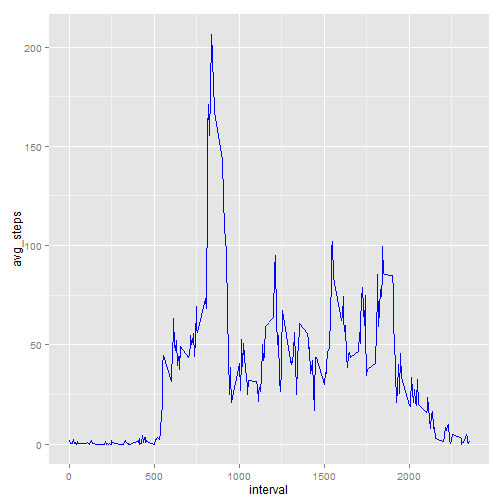

This is an analysis of the Activity Tracker data set found here:
http://github.com/rdpeng/RepData_PeerAssessment1

This analysis will attempt to answer key questions about the individual's movement patterns over the time period recorded. 

#### Loading and Processing Data

The data was initially read in from the working directory and created as a variable here:


```r
activity <- read.csv("./repdata-data-activity/activity.csv")
```

The existing data frame was then read to determine if any more cleaning or processing was needed.


```r
str(activity)
```

```
## 'data.frame':	17568 obs. of  3 variables:
##  $ steps   : int  NA NA NA NA NA NA NA NA NA NA ...
##  $ date    : Factor w/ 61 levels "2012-10-01","2012-10-02",..: 1 1 1 1 1 1 1 1 1 1 ...
##  $ interval: int  0 5 10 15 20 25 30 35 40 45 ...
```

```r
head(activity)
```

```
##   steps       date interval
## 1    NA 2012-10-01        0
## 2    NA 2012-10-01        5
## 3    NA 2012-10-01       10
## 4    NA 2012-10-01       15
## 5    NA 2012-10-01       20
## 6    NA 2012-10-01       25
```

```r
tail(activity)
```

```
##       steps       date interval
## 17563    NA 2012-11-30     2330
## 17564    NA 2012-11-30     2335
## 17565    NA 2012-11-30     2340
## 17566    NA 2012-11-30     2345
## 17567    NA 2012-11-30     2350
## 17568    NA 2012-11-30     2355
```

We see each observation as a date, a five-minute time interval structured as "HH:mm", and a count of the number of steps taken in that interval. The data spans approximately two months of observations. The structure of the data is conducive to analysis, though the "NA" values in the steps column will eventually need to be replaced later in the analysis. 

#### What is the mean total number of steps per day?

To determine the mean total number of steps per day, the steps were summed across unique days, and an exploratory analysis was performed with a histogram of the frequency and count of steps per day.


```r
totalday <- as.matrix(tapply(activity$steps, activity$date, sum, simplify=TRUE))
head(totalday)
```

```
##             [,1]
## 2012-10-01    NA
## 2012-10-02   126
## 2012-10-03 11352
## 2012-10-04 12116
## 2012-10-05 13294
## 2012-10-06 15420
```

```r
library(ggplot2)
qplot(x=totalday, xlab = "Total Steps Taken", 
      main = "Histogram of Total Steps Taken per Day")+geom_histogram(col="blue", fill="white")
```

```
## stat_bin: binwidth defaulted to range/30. Use 'binwidth = x' to adjust this.
## stat_bin: binwidth defaulted to range/30. Use 'binwidth = x' to adjust this.
```

 

From this matrix, we can then determine the total mean and median steps taken per day, removing the "NA" values.


```r
mean_steps <- mean(totalday[,1], na.rm=TRUE)
median_steps <- median(totalday[,1], na.rm=TRUE)
```


#### What is the daily activity pattern?

To determine the daily activity pattern, a data frame was created from the original clean data set that averaged the number of steps taken per five-minute interval across the time span of the study.


```r
averageday <- as.matrix(tapply(activity$steps, activity$interval, mean, na.rm=TRUE, simplify=TRUE))
intervals <- unique(activity$interval)
intervalsteps <- as.data.frame(cbind(intervals, averageday))
colnames(intervalsteps) <- c("interval","avg_steps")
head(intervalsteps)
```

```
##    interval avg_steps
## 0         0 1.7169811
## 5         5 0.3396226
## 10       10 0.1320755
## 15       15 0.1509434
## 20       20 0.0754717
## 25       25 2.0943396
```

This was then plotted for further analysis.


```r
g<- ggplot(intervalsteps, aes(x=interval, y=avg_steps))
g<- g+ geom_line(col="blue")
g
```

 

There is clearly a spike in average activity after 7:50 am, peaking at over 200 steps on average. To determine the exact interval, the data frame was reorganized and the top-most element extracted.


```r
attach(intervalsteps)
```

```
## The following objects are masked from intervalsteps (pos = 3):
## 
##     avg_steps, interval
```

```r
sorted <- intervalsteps[order(-avg_steps), ]
max_steps <- sorted[1,]
max_steps
```

```
##     interval avg_steps
## 835      835  206.1698
```

This indicates the peak number of steps, on average, was taken at approximately 8:35 am.  Because the average number of steps was only just over 200, I can only assume that our subject is frequently late to work, with the steps representing a frantic dash out the door with coffee undoubtedly in hand.

#### Addressing the missing values

In order to form a more complete analysis, the values listed as "NA" should be addressed. I felt the most appropriate way to do this was to replace each "NA" value with the value of the average number of steps typical to that five-minute interval of the day. 

To do this, I first needed to determine how many "NA" values were in each column.


```r
sum(is.na(activity$steps))
```

```
## [1] 2304
```

```r
sum(is.na(activity$date))
```

```
## [1] 0
```

```r
sum(is.na(activity$interval))
```

```
## [1] 0
```

So the only column which needs to be addressed is the steps column. Here, we can use a replace function and replace the "NA" values with the averages from the data frame developed for the previous question. After that replacement, we can see that there are no remaining "NA" values.


```r
activity$steps <- replace(activity$steps, is.na(activity$steps),
                          intervalsteps$avg_steps)
sum(is.na(activity$steps))
```

```
## [1] 0
```

Our new data set has been written to the "activity" variable. A new variable is then generated to compare the mean and median totals from a previous question.


```r
comp_totalday <- as.matrix(tapply(activity$steps, activity$date, sum, simplify=TRUE))
head(comp_totalday)
```

```
##                [,1]
## 2012-10-01 10766.19
## 2012-10-02   126.00
## 2012-10-03 11352.00
## 2012-10-04 12116.00
## 2012-10-05 13294.00
## 2012-10-06 15420.00
```

```r
comp_mean_steps <- mean(comp_totalday[,1], na.rm=TRUE)
comp_median_steps <- median(comp_totalday[,1], na.rm=TRUE)
comp_mean_steps
```

```
## [1] 10766.19
```

```r
comp_median_steps
```

```
## [1] 10766.19
```

The mean and median values from the complete data set closely match the mean and median values calculated from the data set with "NA" values. Here they are plotted for comparison's sake.


```r
qplot(x=totalday, xlab = "Total Steps Taken", 
      main = "Histogram of Total Steps, with NA values")+geom_histogram(col="blue", fill="white")
```

```
## stat_bin: binwidth defaulted to range/30. Use 'binwidth = x' to adjust this.
## stat_bin: binwidth defaulted to range/30. Use 'binwidth = x' to adjust this.
```

 

```r
qplot(x=comp_totalday, xlab = "Total Steps Taken", 
      main = "Histogram of Total Steps, with Mean values")+geom_histogram(col="white", fill="green")
```

```
## stat_bin: binwidth defaulted to range/30. Use 'binwidth = x' to adjust this.
## stat_bin: binwidth defaulted to range/30. Use 'binwidth = x' to adjust this.
```

 

There is a slight degree of shifting, but for the most part, generating more samples did not shift the distribution significantly. Go Go Gadget Central Limit Theorem!

#### Are there differences between Weekends and Weekdays?

To determine the difference between weekend and weekday activity, the dates must be coerced into a day-name format, here using the weekdays() function.


```r
days<- as.Date(activity$date)
head(days)
```

```
## [1] "2012-10-01" "2012-10-01" "2012-10-01" "2012-10-01" "2012-10-01"
## [6] "2012-10-01"
```

```r
class(days)
```

```
## [1] "Date"
```

```r
str(days)
```

```
##  Date[1:17568], format: "2012-10-01" "2012-10-01" "2012-10-01" "2012-10-01" ...
```

```r
activity$days <- weekdays(days)
unique(activity$days)
```

```
## [1] "Monday"    "Tuesday"   "Wednesday" "Thursday"  "Friday"    "Saturday" 
## [7] "Sunday"
```

Another set of replacement functions changed the values to either "weekday" or "weekend".


```r
activity$days <- replace(activity$days, 
                         activity$days %in% c("Monday", "Tuesday","Wednesday", "Thursday","Friday"), "weekday")
activity$days <- replace(activity$days, 
                         activity$days %in% c("Saturday", "Sunday"), "weekend")
unique(activity$days)
```

```
## [1] "weekday" "weekend"
```

The data was then split between "weekday" and "weekend" data sets, for simpler plotting and continued analysis.


```r
head(activity)
```

```
##       steps       date interval    days
## 1 1.7169811 2012-10-01        0 weekday
## 2 0.3396226 2012-10-01        5 weekday
## 3 0.1320755 2012-10-01       10 weekday
## 4 0.1509434 2012-10-01       15 weekday
## 5 0.0754717 2012-10-01       20 weekday
## 6 2.0943396 2012-10-01       25 weekday
```

```r
weekdays <- activity[ which(activity$days == "weekday"), ]
weekends <- activity[ which(activity$days == "weekend"), ]
unique(weekdays$days)
```

```
## [1] "weekday"
```

```r
unique(weekends$days)
```

```
## [1] "weekend"
```

The average steps by five-minute interval was then calculated by looping the mean function over each data set. The resulting sets were cleaned and formatted into one block for exploratory plotting.


```r
weekdays <- as.matrix(tapply(weekdays$steps, weekdays$interval, mean, na.rm=TRUE, simplify=TRUE))
intervals <- unique(activity$interval)
weekdays<- as.data.frame(cbind(intervals, weekdays))
weekdays$day <- "weekday"
colnames(weekdays)<- c("interval","steps","day")

weekends <- as.matrix(tapply(weekends$steps, weekends$interval, mean, na.rm=TRUE, simplify=TRUE))
weekends <- as.data.frame(cbind(intervals, weekends))
weekends$day <- "weekend"
colnames(weekends) <- c("interval","steps","day")

intervalsteps <- as.data.frame(rbind(weekends, weekdays))
head(intervalsteps)
```

```
##    interval       steps     day
## 0         0 0.214622642 weekend
## 5         5 0.042452830 weekend
## 10       10 0.016509434 weekend
## 15       15 0.018867925 weekend
## 20       20 0.009433962 weekend
## 25       25 3.511792453 weekend
```

```r
tail(intervalsteps)
```

```
##       interval     steps     day
## 23301     2330 3.0360587 weekday
## 23351     2335 2.2486373 weekday
## 23401     2340 2.2402516 weekday
## 23451     2345 0.2633124 weekday
## 23501     2350 0.2968553 weekday
## 23551     2355 1.4100629 weekday
```

```r
str(intervalsteps)
```

```
## 'data.frame':	576 obs. of  3 variables:
##  $ interval: num  0 5 10 15 20 25 30 35 40 45 ...
##  $ steps   : num  0.21462 0.04245 0.01651 0.01887 0.00943 ...
##  $ day     : chr  "weekend" "weekend" "weekend" "weekend" ...
```

The average steps were then plotted across the five-minute intervals for both weekends and weekdays. I elected to use an overlaid plot to facilitate easy comparison. 


```r
g<- ggplot(intervalsteps, aes(x=interval, y=steps, color= factor(day))) + ylab("Average Steps")
g<- g+ geom_line()+ggtitle('Average Steps, Weekdays vs Weekends') + theme(legend.title=element_blank())
g
```

 

Weekends demonstrate more frequent yet lower activity peaks, consistent with steady activity throughout the day, while weekdays demonstrate a much lower average activity level, with the only real peak being the 8:35 run out the door. It is highly likely that this individual is a data scientist, or a similarly desk-bound creature.


